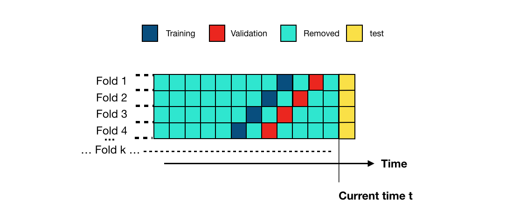

# ML System Design Doc Challenge

## Дизайн ML системы - Anti-Fraud

## 1. Цели и предпосылки

### 1.1. Зачем идем в разработку продукта?

- Бизнес-цель
    - Целью внедрения данного проекта является увеличение эффективности банковской системы [антифрода](https://ru.wikipedia.org/wiki/Антифрод) для снижения финансовых и репутационных рисков связанных с мошенническими действиями. Ключевые задачи включают уменьшение количества пропущенных мошеннических (фродовых) операций, оптимизацию работы аналитиков за счет автоматизации процесса выявления подозрительных транзакций и улучшение клиентского опыта за счет сокращения неоправданных блокировок транзакций.
- Почему станет лучше, чем сейчас, от использования ML
    - Дополнительное использование машинного обучения позволит улучшить качество детекции мошеннических операций. Основной проблемой `rule-based моделей` обычно является их **негибкость** и **зависимость от предустановленных правил**, что ограничивает их способность адаптироваться к меняющимся стратегиям мошенников. `ML-модель`, наоборот, способна обучаться на исторических данных и **адаптироваться** к новым видам мошенничества. Так же когда `rule-based модель` имеет большое количество правил, то становиться сложно их контролировать. Она сможет выявлять сложные паттерны и зависимости в данных, недоступные для простого правила, и тем самым повысить качество детекции.
    - `Rule-based модель` планируется оставить для обработки хорошо детектируемых транзакций и черных списков
    - Что будем считать успехом с точки зрения бизнеса
        
        Для измерения критерия успеха используем окупаемость системы. Доходом является уменьшение штрафов и негативного влияния. Затратами являются затраты на разработку и сопровождение. При окупаемости за `N` месяцев считаем успешным внедрением.
        
        Для оценки будем использовать следующие ключевые показатели:
        
        1. Снижение количества пропущенных фродовых операций и соответствующее уменьшение размера штрафов от регулятора.
        2. Уменьшение количества неоправданно заблокированных транзакций для улучшения клиентского опыта.
        3. Увеличение эффективности работы аналитиков антифрод системы за счет снижения количества требующих ручной проверки транзакций.
        4. Поддержание или увеличение клиентской базы за счет улучшения качества антифродовых мер и соответствующего увеличения доверия.
- Стоимость
    - Затраты на работу датасаентистов: Включает зарплаты и прочие расходы, связанные с наймом и содержанием команды датасаентистов, занимающихся разработкой и обслуживанием ML-моделей для антифрод системы.
    - Затраты на инфраструктуру ML-моделей: Это включает расходы, связанны с необходимой инфраструктурой для развертывания и работы ML-моделей . Это может включать в себя затраты на вычислительные ресурсы (например, серверы или облачные вычисления), хранение данных, сетевую инфраструктуру, обеспечение безопасности и т.д. Инфраструктура ML-моделей может быть дорогостоящей и требовать постоянной поддержки и обновлений, особенно при обработке больших объемов данных или в условиях высоких требований к производительности и доступности системы.
    
    Если затраты на создание MVP системы превысят потери от фрода за `N` месяцев после запуска MVP, то стоит поставить вопрос о целесообразности продолжении исследовательской работы в направлении ML-system.
    

### 1.2. Бизнес-требования и ограничения

- Краткое описание бизнес-требований. Проект направлен на повышение эффективности обнаружения и предотвращения фродовых операций путем внедрения ML-решения. Бизнес-требования включают создание и интеграцию модели, которая может обрабатывать входные данные транзакций (время, сумма, id отправителя и получателя, канал перевода, id банка отправителя и получателя, назначение платежа, данные клиента и устройства), чтобы выявлять потенциальные мошеннические действия.
- Интерпретируемость модели. Требуется для понимания мошеннических операций и адекватности модели, так же для поиска путей улучшения ситсемы.
- Бизнес-ограничения. Включают ограниченное количество аналитиков для проверки транзакций и тайминг, в рамках которого следует обнаруживать и блокировать подозрительные операции, чтобы избежать штрафов и убытков. Кроме того, система должна минимизировать ложные положительные срабатывания, чтобы не ухудшать клиентский опыт и не приводить к потере клиентов, минимизация фродовых транзакций, чтобы не получать штрафы от регулятора.
- Описание бизнес-процесса пилота, как именно мы будем использовать модель в существующем бизнес-процессе
    - После разработки и тестирования ML-модель будет интегрирована в существующую систему антифрода. Входные данные о транзакциях будут подаваться на вход модели, которая будет генерировать оценку риска мошенничества для каждой транзакции. Rule-based модель остается работать параллельно, а конечный вердикт выносится на основе предикта от обеих систем. Rule-based модель может включать хорошо детектируемые случаи, черные списки, а так же направлять не дополнительную проверку транзакции с большими суммами.
    - Во время пилотного проекта мы будем тщательно отслеживать и сравнивать эффективность модели ML с текущей системой на основе правил.
    - Однако, стоит отметить, что точную эффективность и преимущества использования ML-модели мы сможем определить только после проведения `А/B тестирования` и `экономической целесообразности`. А/B тестирование позволит нам получить надежные данные о работе модели в реальных условиях и сравнить ее эффективность с существующей системой, а оценка экономической целесообразности даст нам понять стоит ли внедрять наше ML-решение.
    - Так как система антифрод это критичная система. То запуск должен быть под контролем, например запись в результатов отдельную базу, которая не принимает участия в принятии решений. Такой подход обоснован, как минимум на начальных этапах запуска.
- Что считаем успешным пилотом. Успешным пилотом можно считать положительную экономическую оценку, основываясь на бизнес метрике (пункт 1.5):
- Возможные пути развития проекта:
    - расширение обучающего набора данных
    - адаптация модели (дообучение) для обработки новых типов транзакций
    - расширение функциональности модели для более тонкой настройки
    - оптимизации работы с мошенническими действиями
    - добавление новых моделей (см. Интерпретируемость модели Product Owner)

### 1.3. Что входит в скоуп проекта/итерации, что не входит

- Что не будет закрыто
    - Проект не решит проблемы, связанные с `социально-инженерными атаками` на клиентов. Например, когда модель выявила фрод активность, с клиентом связался аналитик, которому `подтвердили`, что все хорошо, но на самом деле злоумышленнику удалось убедить клиента в необходимости сделать перевод используя `социальную-инженерию`.
    - Мы будем решать задачу классификации. В этом контексте задача детекции аномалий - это вспомогательный инструмент для поиска нового вида фрода, ручной обработки аномалий, Active Learning для разметки. Детекция такого рода не входит в скоуп проекта и является улучшением. Вариант реализации - Isolation Forest
- Описание результата с точки зрения качества кода и воспроизводимости решения
    - Результат проекта будет включать в себя четко описанный и документированный код, который можно легко внедрить в существующую систему. Модель должна быть обучена и протестирована, а ее производительность должна быть оценена с использованием отдельного тестового набора данных. Код будет структурирован таким образом, чтобы обеспечить воспроизводимость (фиксация: `random seed`, `гипер-параметры модели`, `метрик`, `train/test/valid датасет`, `aртефакты`, `модель`).
- Описание планируемого технического долга
    - Возможные аспекты технического долга могут включать оптимизацию алгоритмов для улучшения производительности, интерпретируемости и интеграции решения.

### 1.4. Предпосылки решения

- **Данные.** Наше решение будет базироваться на данных, предоставляемых финтех компанией, включающих данные о переводах, данные о клиентах и  сторонние данные, полученные законным путем. Мы предполагаем, что эти данные достаточно полны и точны для обучения модели машинного обучения.
- **Горизонт прогноза или режим работы:** онлайн
- **Гранулярность модели.** Мы предполагаем, что наша модель будет работать на уровне отдельных транзакций, анализируя каждую транзакцию по отдельности. Это обусловлено потребностью бизнеса в реальном времени обнаруживать и блокировать подозрительные транзакции.
- **Процесс.** Мы предполагаем, что модель будет интегрирована в существующую систему обработки транзакций и будет работать совместно с rule-based антифрод системой. Простыми правилами занимаются правила, а сложными МЛ. Модель может плохо работать на простых случаях. И в тоже время это экономия ресурсов и более итерационное внедрение.
- **Типы фрода:** Мы предполагаем, что модель должна справляться со всеми основными типами фрода, которые встречаются в наших данных, например, схемы [обналичивания](https://ru.wikipedia.org/wiki/Обналичка), использование [дропов](https://xn--e1afpuhk.com/kartochnye-moshennichestva-s-uchastiem-dropov/), [фишинга](https://ru.wikipedia.org/wiki/Фишинг) и так далее.
- **Работа с ошибками:** Анализ ошибок и интерпретация работы модели в этих случаях необходимы для понимания краевых условий и поиска улучшения модели. В анализ входит поиск кластеров, на которых система дает ошибки, а так же ручной анализ транзакций.
    
    
    ### 1.5. **Бизнес-метрики**
    
    Определяем ключевые показатели, которые далее агрегируем в единую формулу в деньгах, понятную бизнесу. Показателями являются:
    
    - Размер штрафа в конце месяца: эта метрика отражает суммарный размер штрафов. Успешная работа системы антифрод должна уменьшать этот размер, указывая на эффективность ее действий.
    - Профит от транзакций:  отражает полученных финтех компанией процент за выполненную транзакцию, зависит от количества ложных срабатываний антифрод системы, потому что эти транзакции блокируются и не приносят профит.
    - Количество обращений в поддержку: это позволяет измерить, насколько успешно система антифрод предотвращает мошенническую активность и снижает необходимость клиентов обращаться в поддержку в связи с мошенническими операциями или ложными блокировками.
    
    Определим profit в деньгах как основную бизнес метрику на основе этих показателей
    
    $$
    profit = \lambda\space * \sum_{t}^{TN+FN}p_t\space - \space\sum_{t}^{FN}p_t\space -p_c * \beta * m\space - \mu * n-\lambda\space * \sum_{t}^{FP}p_t
    $$
    
    Где
    
    **профит от транзакций (первое слагаемое):**
    
    *lambda - процент, который банк получает за выполненную транзакцию*
    
    *****TN (True Negative) - количество транзакций, помеченное моделью как не фрод, при этом в действительности фродом не являющеяся*****
    
    FN (False Negative) - количество пропущенных фродовых транзакций, эти транзакции в результате выполняются банком.
    
    p_t - сумма транзакции 
    
    **сумма штрафов (первое слагаемое со знаком минус)**
    
    *****FN (False Negative) - к-во транзакций, помеченное моделью как не фрод, при этом в действительности являющиеяся фродом*****
    
    **оценка убытка от ушедших клиентов (второе слагаемое со знаком минус):**
    
    beta *- средняя вероятность ухода клиента после жалобы*
    
    *p_c - средний убыток от потерянного клиента*
    
    m - количество жалоб на ложную блокировку транзакции
    
    **затраты на аналитиков (третье слагаемое со знаком минус)**
    
    n *-  количество подозрительных транзакций, обрабатываемые аналитиками*
    
    *mu - средняя стоимость обработки одной подозрительной транзакции*
    
    **недополученные проценты от ложно заблокированных транзакций (четвертое слагаемое):**
    
    *****FP (False Positive) - к-во транзакций, ошибочно помеченное моделью как фрод, которые были заблокированы и не исполнены*****
    
    Мы используем некоторую степень детализации бизнес метрики без учета выбросов в сумме транзакций и парируем rule-based моделью отправлять транзакции с большой суммой на дополнительную проверку аналитиками.
    
    Определим Normalized Profit как бизнес метрику для сравнения моделей. 
    
    Данная метрика учитывает финансовые результаты компании с учетом предотвращенных мошеннических транзакций и возможных потерь, связанных с ложными срабатываниями системы антифрод.
    
    Отрицательное значение означает убытки, нулевое отсутсвие убытков или прибыли, чем ближе к 1.0, тем ближе прибыль к максимально возможной
    
    $$
    max\space profit = \lambda\space * \sum_{t}^{N}p_t
    $$
    
    $$
    nProfit = \frac{profit}{max\space profit}
    $$
    
    *****N - количество всех нефродовых транзакций*****
    

## 2. Методология

### 2.1. Постановка задачи

Задача бинарной классификации с большим дисбалансом классов. 

### 2.2. Блок-схема решения

См. пункт **“Архитектура решения”**

### 2.3. Этапы решения задачи

### 2.3.1 Выбор метрик

**Оффлайн-метрики** - это метрики, оценивающие производительность системы  на основе исторических данных и фактических результатов. 

Распределение транзакций в исходной системе

В соответствии с бизнес метрикой наша основная цель уменьшить убытки от штрафов, что соответствует метрике Recall. А также сохранить пользователей и не создавать лишних блокировок, что соответствует Specificity. На данных исторической системы определили Recall@Specificity 99.85% = 50%  и считаем целью увеличить Recall при условии неухудшения Specificity. Таким образом, мы предполагаем, что эта метрика коррелирует с бизнес метрикой. Соотвественно целевая метрика обучения **Recall@Specificity > 99.85%**. 

Метрика Recall@Specificity является гладкой монотонной, что позволяет использовать быстрый бинарный поиск для определения порога и немного увеличивает скорость последовательности действий обучения.

**Онлайн метрики** -  это метрики, которые мы можем получить во время работы системы. 

Мы не можем иметь какой-либо хорошей онлайн метрики. Но такая метрика понадобится для проведения AB-теста. Поэтому придется использовать прокси-метрики, такие как количество жалоб и подобные.

**Технические метрики** - это метрики, связанные с производительностью и скоростью работы системы антифрод. Некоторые примеры таких метрик включают:

- Скорость обработки транзакций антифрод системой: эта метрика измеряет время, затраченное системой антифрод на обработку каждой транзакции. Ожидается, что время обработки будет ≤ *1c*, чтобы не ухудшать пользовательский опыт и обеспечивать быструю реакцию на мошеннические операции.

Выбор этих метрик позволяет нам оценить эффективность системы  с различных сторон, включая бизнес-показатели, точность обнаружения мошеннической активности и производительность системы. Это позволит нам принять более информированные решения и улучшить антифрод систему  в соответствии с требованиями проекта и бизнес-целями.

### 2.3.2 Определение объекта и таргета

- Объект - транзакция, которая включает уникальные идентификаторы получателя и отправителя, время и другие поля.
- Целевая переменная: мошенническая транзакция помечается как "1", а немошенническая транзакция - как "0".

### 2.3.3 Сбор данных

Целевая переменная, помещающая транзакции как фрод, получаем из трех источников

- помеченные аналитиками транзакции как фрод
- транзакции, которые были помечены rule-based системой как гарантированный фрод и отклоненные сразу (black-list)
- транзакции, по котором пришли штрафы
- транзакции, по которым были подтвержденные жалобы на фрод

Информация о получении данных:

| Название данных | Есть ли данные в компании (если да, название источника/витрины) | Требуемый ресурс для получения данных (какие роли нужны) | Проверено ли качество данных (да, нет) |
| --- | --- | --- | --- |
| Истории транзакций за последние N-месяцев | Да, хранятся в базе данных компании | Product owner | Нет |
| Целевая переменная | Да, содержится в данных истории транзакций | Product owner/ Отдел аналитиков | Нет |
| Время транзакции | Да, содержится в данных истории транзакций | Product owner | Нет |
| Сумма транзакции | Да, содержится в данных истории транзакций | Product owner | Нет |
| ID отправителя | Да, содержится в данных истории транзакций | Product owner | Нет |
| ID получателя | Да, содержится в данных истории транзакций | Product owner | Нет |
| Канал перевода | Да, содержится в данных истории транзакций | Product owner | Нет |
| ID банка отправителя | Да, содержится в данных истории транзакций | Product owner | Нет |
| ID банка получателя | Да, содержится в данных истории транзакций | Product owner | Нет |
| Назначение платежа* | Да, содержится в данных истории транзакций | Роль с доступом к базе данных | Нет |
| Данные клиента (соц демо, последние операции) | Да, хранятся в базе данных компании | Product owner | Нет |
| Данные устройства, с которого переводят (версия ОС, имя приложения и т.п.) | Да, хранятся в базе данных компании | Product owner | Нет |

### 2.3.4 Подготовка данных

Этап 0: анализ временного ряда на в всех доступных данных (3 года). Проверка гипотез о сезонности транзакций в рамках разных регионов. По результату: принятие решение об отрезке времени, на котором будет основано итоговое решение задачи. 

Этап 1: Проверка каждого признака

| Название данных | Требования |
| --- | --- |
| Истории транзакций за последние N-месяцев | - Убедиться, что данные охватывают выбранный период без пропусков. |
| Целевая переменная | - Определить критерии классификации мошеннических операций. |
| Время транзакции | - Убедиться в правильном формате данных времени. |
| Сумма транзакции | - Проверить отсутствие пропусков в колонке с суммой транзакции. |
| ID отправителя | - Проверить отсутствие пропусков в колонке с ID отправителя. |
| ID получателя | - Проверить отсутствие пропусков в колонке с ID получателя. |
| Канал перевода | - Проверить наличие корректных значений каналов перевода. |
| ID банка отправителя | - Проверить наличие корректных значений ID банка отправителя. |
| ID банка получателя | - Проверить наличие корректных значений ID банка получателя. |
| Назначение платежа* | - Проверить наличие и корректность данных в поле назначения платежа. |
| Данные клиента (соц демо, последние операции) | - Определить необходимые атрибуты клиента и проверить их наличие и корректность. |
| Данные устройства, с которого переводят | - Определить необходимые атрибуты устройства и проверить их наличие и корректность. |

Этап 2: Оценка сбалансированности набора данных (сопоставимы ли соотношения между классами в рамках датасета)

**Результат:** Чистый и корректный набор данных для задачи

### 2.3.4 Работа с  признаками

- Проверка распределения транзакций во временном ряду в рамках выбранного отрезка времени, проверка отсутствия значительных пропусков.
- Оценка распределений целевого признака для типа перевода Card2Card/Account2Account. Проверка гипотез о специфичностях категорий (разные по сумме типичные транзакции, разная частота транзакций, разное соотношение мошеннических транзакций);
- Проверка гипотез о сезонности. Уточнение отрезка времени, необходимого для пересчета модели;
- Оценка корректности разметки данных. Часть данных может быть передана на повторную проверочную разметку для подтверждения уверенности в разметке;
- Оценка важности признаков для baseline и MVP, формулирование гипотез для новых признаков с целью улучшения качества системы (возможные варианты признаков — время между транзакциями одного пользователя, обыкновенная частота транзакций для времени/дня недели, неизвестный (новый) девайс пользователя);
- Признак времени с последний транзакции, количества транзакций за последние N минут;
- Признак нового устройства, локации;

**Результат:** 
1. Включение или исключение фактора полной даты транзакции в датасет;
2. Проверено влияние фактора ошибки разметчиков в наборе данных;
3. Сформулированы гипотезы о возможных новых признаках для обогащения набора данных;
4. Сделана оценка оптимального периода перетренировки модели, в том числе с учетом задержки в получении разметки новых данных.

**Необходимая проверка бизнеса:** оценка согласованности гипотез о новых признаках с предметной областью

### 2.3.5 Оценка поведения baseline

### 2.3.5.1 Применение методов интепретации к признакам для baseline

**Возможные методы:** Permutation importance, Individual Conditional Expectation and Partial dependence plots

**Результат:** При необходимости коррекция признаков на основе выводов, извлекаемых с интерпретацией

**Необходимая проверка бизнеса:** оценка согласованности интерпретаций с предметной областью для избежания искажений 

### 2.3.6 Подготовка тренировочного и тестового наборов данных

На основе EDA для формирования train, valid и test set планируется учесть следующие составляющие:

1. Нюансы временного ряда — разбиение датасета без внесения информации о потенциальном будущем в модель;
2. Разделение с одинаковым распределением таргета, так как есть дисбаланс. Допустимо использовать undersampling и oversampling для выравнивания дисбаланса, а при необходимости более сложных методов SMOTE/ADASYN (увеличение малого класса за счёт представителей выпуклых комбинаций пар)

**Результат:** Сформированы выборки для обучения, валидации и финального тестирования модели

### 2.3.7 Валидация

- В качестве валидационной стратегии будет использоваться Time-Series Validation, которая учитывает временные аспекты данных и обеспечивает более реалистичную оценку ее производительности.

- При использовании Time-Series Validation датасет делится на K фолдов, где каждый фолд представляет собой свой временной промежуток данных, при этом заранее делается отложенная выборка, представляющая последнюю часть данных, на которой делаются финальные замеры качества. Эта отложенная выборка не меняется для всех фолдов. Это означает, что каждый фолд содержит информацию о транзакциях, произошедших в определенный период времени.
- Кроме того, между тренировочным и валидационным набором данных также существует временной отрезок (скорее всего это 1 или 2 недели). Это означает, что модель обучается на данных, предшествующих временному отрезку, и затем тестируется на данных, находящихся в этом отрезке. Таким образом, мы имитируем реальные условия, в которых модель должна делать прогнозы на будущих данных, основываясь только на прошлых данных.
- Использование Time-Series Validation позволяет учесть хронологический порядок данных и оценить производительность модели в реалистичных условиях.

### 2.3.8 Выбор архитектуры модели для решения задачи

### От baseline к полноценной модели

В качестве отправного качества планируется взять качество нынешней rule-based системы.

**Особенности работы**

Учитывая особенности исторической системы, оставляем возможность, что модель имеет выход Разрешить/Сомнительно/Запретить. Сомнительные отправляются на проверку аналитиками.

Система, как было указано выше, будет работать параллельно с rule-based моделью. Rule-based модель остается работать параллельно, а конечный вердикт выносится на основе предикта от обеих систем. Rule-based модель может включать хорошо детектируемые случаи, черные списки, а так же направлять не дополнительную проверку транзакции с большими суммами.

Заявки для аналитиков обрабатываются очередью с учетом приоритета, который определяется на основе score и суммы транзакции.

В случае небольшой загруженности аналитиков, на них назначается случайная часть транзакций с низким приоритетом для разметки будущего переобучения.

**Этап 1 (MVP)**. Тестирование избранных алгоритмов — `ONE-CLASS SVM`, `Logistic Regression`, `Random Forest`, `XGBoost`. Данные методы способны обнаруживать аномалии в данных, что является важным для предотвращения мошенничества. Все перечисленные модели интерпретируются. По ретроспективе, по сравнению с Rule-Based подходом, такие методы способны, при корректном обучении, кратно улучшить качество системы. После этого следует этап 2.3.10 и итерационная доработка. 

**Этап 2**. Тестирование оптимизаций для алгоритмов, бьющих baseline.

Данный этап включает в себя варьирование гиперпараметров — математических и эвристических показателей модели, для её улучшения, а так же подбор подходящих признаков

**Этап 3**. Разработка архитектуры нейронной сети для решения задачи - `Autoencoder`, `Autoencoder+GAN`. Плюсы нейросетевего подхода является предполагаемая более высокая точность, минусами — более сложная интерпретируемость с использованием соответствующих библиотек.   

**Autoencoder** обучается на на обычных транзакциях, ошибка восстановления является критерием для определения как фрод

**Autoencoder+GAN** основан на следующем [принципе](https://arxiv.org/pdf/1908.11553.pdf):

1. Берем хорошие транзакции, учим на них Autoencoder
2. Репрезентация после encoder, полученная от sparse autoencoder становится новыми фичами
3. Учим GAN, где реальные образцы - это репрезентация существующих хороших транзакций с пункта 2, а фейковые шум
4. Снимаем с GAN дискриминатор и используем его теперь чтобы принять решение о транзакции (прогнанной сначала через Autoencoder) - фрод или нет

**Этап 4**. Сопоставление качества проверенных моделей по целевой метрике. Выбор конечной архитектуры/структуры модели.  

1. Берем хорошие транзакции, учим на них sparse autoencoder
2. Репрезентация (code после encoder) полученная от sparse autoencoder становится новыми фичами
3. Учим GAN, где реальные образцы - это репрезентация существующих хороших транзакций с пункта 2, а фейковые, понятное дело, шум
4. Снимаем с GAN дискриминатор и используем его теперь чтобы принять решение о транзакции (прогнанной сначала через sparse autoencoder) - фрод или нет
5. Берем хорошие транзакции, учим на них sparse autoencoder
6. Репрезентация (code после encoder) полученная от sparse autoencoder становится новыми фичами
7. Учим GAN, где реальные образцы - это репрезентация существующих хороших транзакций с пункта 2, а фейковые, понятное дело, шум
8. Снимаем с GAN дискриминатор и используем его теперь чтобы принять решение о транзакции (прогнанной сначала через sparse autoencoder) - фрод или нет

**Результат:** Выбрано три приоритетных типа модели для дальнейшей оптимизации

### 2.3.9 Методы интерпретации

- Используем анализ интерпретируемости по всей модели для выявления паттернов и значимых признаков
- Используем анализ интерпретируемости отдельного предикта для обработки ошибок и анализа конкретных видов фрода
- Способы интерпретации моделей**:**
    - Для стандартных методов Isolation Forest, One-class SVM, LR, RF, XGBoost существуют стандартные интерпретации, например на SHAP
    - Для нейросетевых моделей можем так же использовать SHAP. Например [тут](https://heka-ai.medium.com/detection-and-interpretation-of-outliers-thanks-to-autoencoder-and-shap-values-c8bcdc5ebc1e) есть применение SHAP для интерпретации Autoencoder. Для связки Autoencoder+GAN интерпретация может быть сложнее, но принцип останется тот же, так как в режиме инференса модель будет представлять единую нейросеть.
    - Так же в качестве возможных методов интерпретации, которые можно подсчитать почти для любого типа моделей — Permutation importance, Individual Conditional Expectation, Counterfactual Explanations and Partial dependence plots.

### 2.3.9 Анализ ошибок

Анализ наличия и природы ошибок в MVP. Проверка модели при помощи методов интерпретации, оценка корректности гиперпараметров. При необходимости возвращение к пунктам 2.3.4—2.3.8.

**Результат:** Модель, достигающая качества на тестовом наборе данных, соответствующего бизнес требованиям. 

**Необходимая проверка бизнеса:** Согласованность качества модели с требованиями бизнеса;

## 3. Подготовка пилота и внедрения

### 3.1. Архитектура решения

Архитектура решения. 

**Белые блоки** - историческая система

**Цветные блоки** - новая система

**Темный цвет** выделяет блоки, относящиеся к пилоту

### 3.2. Способ оценки пилота

В исторической системе транзакции поступали на RuleBased блок. Добавляем  Switch, который будет разделять и/или перенаправлять транзакции на новую или историческую системы. Разделение транзакций позволит сделать AB-тест, посчитать офлайн метрики и оценить эффективность решения.

Для AB-теста мы не имеем хорошую онлайн метрику, поэтому можем оценивать прокси метрики, такие как жалобы от пользователей. Мы разбиваем транзакции на группы AB или AAB. Так же проводим отложенную оценку офлайн и бизнес метрик, возможно в несколько временных точках, для сравнения.

Последовательность подготовки AB-теста:

- Определить метрики:
    - Целевая метрика, которая будет оцениваться в тесте. Что мы можем использовать для целевой метрики? Либо прокси-метрику в виде подсчета жалоб, либо уже после пилота офлан бизнес метрику. И тот и тот вариант. 
    - Вспомогательные метрики, которые должны показать, что тест идет так как предполагалось и не затронул другие области, например это количество транзакций, сумма транзакций и т.д.
    - Контрольные метрики, которые будут позволять отлавливать проблемы, такие как время проведения транзакции, обращения в поддержку и другие
- Определить с бизнесом, какой эффект мы собираемся детектировать. Определить уровень значимости и допустимый уровень ошибок второго рода
- Отбор групп должен производиться по транзакциям, а не по пользователям, чтобы избежать зависимости данных. Обычно, в организации проводятся несколько AB-тестов и существует система разбиения с одинарным или двойным хешированием
- Оценить возможности увеличения мощности теста, такие как уменьшение дисперсии, стратификация, CUPED и другие
- Оценив требуемый минимальный детектируемый эффект и сезонность данных определить требуемый процент транзакций и длительность проведения теста. Если в пределах проведения теста есть волатильность целевой метрики, то нужно использовать нестандартные тесты, которые допускают волатильность метрики
- Подготовить техническую основу теста
- Проверить тест на исторических данных и подтвердить уровни ошибок первого и второго рода

Во время проведения пилота

- При первом запуске предусмотреть “параллельный” запуск, при котором решение, принятое системой по каждой транзакции, не идет в работу, а сохраняется отдельно для анализа
- Возможно, использовать постепенное развертывание, при котором мы запускаем на новую систему не сразу на всех планируемых транзакциях
- Следить за мониторингом корректности проведения эксперимента

### 3.3. Что считаем успешным пилотом

По завершению теста принимаем решение. 

Успешным проведение пилота считается при условиях:

- Целевая метрика статистически значимо выросла
- Контрольные метрики не упали
- Вспомогательные метрики не противоречат друг другу и целевой

В случае успеха пилота переходим к внедрению. В случае неуспеха определяем и исправляем ошибки или улучшаем модель и систему, либо переходим к другим типам решения или отказываемся от решения.

При любом исходе пилота мы собираем аналитику, новые идеи и гипотезы. А так же сохраняем все результаты.

Для измерения критерия успеха используем окупаемость системы. Доходом является уменьшение штрафов и негативного влияния. Затратами являются затраты на разработку и сопровождение. При окупаемости за N месяцев считаем успешным внедрением. **Оставить? Нет четкости? Не относится к тесту? Нет четко выбранного критерия принятия решения? Мы как-то оцениваем эти показатели? Или только помещаем их в вспомогательные?** 
1. Снижение количества пропущенных фродовых операций и соответствующее уменьшение размера штрафов от регулятора. 
2. Уменьшение количества неоправданно заблокированных транзакций для улучшения клиентского опыта. 
3. Увеличение эффективности работы аналитиков антифрод системы за счет снижения количества требующих ручной проверки транзакций. 
4. Поддержание или увеличение клиентской базы за счет улучшения качества антифродовых мер и соответствующего увеличения доверия. 

### 3.4. Описание инфраструктуры и масштабируемости

- Несмотря на сравнительно небольшую среднюю нагрузку в 1.5 транзакций в секунду, нужно предусмотреть отработку пиковых нагрузок, связанных с цикличностью нагрузки и фрод атаками
- Очередь сообщений может быть организована на брокере сообщений, например Kafka
- Инференс модели может быть организован в Kubernetes кластере с автоматическим подключением нод на основе события системы мониторинга

### 3.5. Мониторинг

Сервис мониторинга контролирует:

- Технические метрики
- Нагрузка на сервер
- Нагрузка на сервис
- Прокси метрика количество жалоб
- Офлайн метрики
- Дата дрифт

В результате превышения порогов вызываются 

- переключение на предыдущую или историческую модель
- оповещения аналитикам и другим службам
- запуск пайплана переобучения

### 3.6. Требования к работе системы

- Пропускная способность и задержка обеспечивается структурой и возможностью масштабирования

### 3.7. Безопасность системы

Обеспечивается отсутствием внешних связей

### 3.8. Безопасность данных

Безопасность данных обеспечивается 100% хранением на внутренних серверах

### 3.9. Издержки

- Расчетные издержки на работу системы в месяц
- Зарплаты 3 МЛ специалистов на период от 2 - 4 месяцев для создания MVP
- Затраты на инфраструктуру

### 3.10. Риски

- Риск пропустить фродовую операцию с большой суммой - создание правил проверки аналитиками всех операций с большой суммой, подкрепляя прогнозом и интерпритацией кейса, полученными моделью
- Сбой работы модели в результате хакерских атак - создание standby сервисов на уровне инфраструктуры;
- Технический сбой в модели - переключаемся на предыдущую или историческую
- Сбой метрик мониторинга выше среднего порога - оповещение
- Сбой метрик мониторинга выше верхнего порога - переключаемся на предыдущую или историческую
- Риск пропуска данных - контролируется на уровне целостности данных
- Большое количество перенаправляется на аналитиков - создание алертов для подключения аналитиков, временное оперативное изменение порогов модели
- Новый тип фрода - быстрое добавление новых правил, разметка, переобучение, проверка